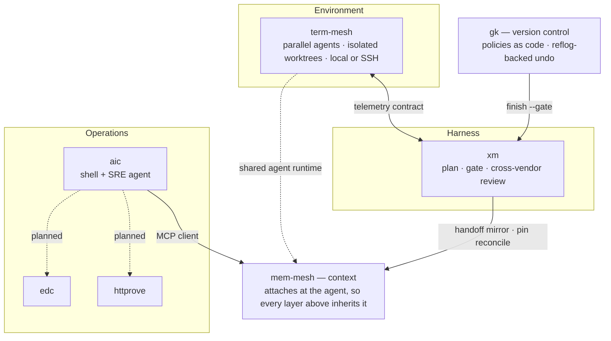

<h1 align="center">x-mesh</h1>

  <strong>Find out what's actually wrong, without making it worse.</strong>

  Tools built from one habit carried over from running production systems:
  limit the blast radius first, then judge on evidence instead of assumption.

  Most agent tooling ships the environment, the harness, and the memory as one
  product. These are the same layers, kept separate &mdash; each usable on its own,
  wired to the others by contract rather than by bundling.

---

## The layers

| Layer | | What it owns |
|---|---|---|
| **Environment** | [term-mesh](https://github.com/x-mesh/term-mesh) | Where agents run. A team of them in parallel, each in its own sandboxed worktree, on this Mac or over SSH. |
| **Harness** | [xm](https://github.com/x-mesh/xm) | What gets built, and whether it ships. Plans grounded in repository evidence, the smallest sufficient change, a cross-vendor panel that gates the result. |
| **Context** | [mem-mesh](https://github.com/x-mesh/mem-mesh) | What survives the session. Decisions that never reach git, resumable work state, injection that is measured rather than assumed. It attaches at the agent, not at the app, so every layer that runs an agent inherits it. |
| **Version control** | [gk](https://github.com/x-mesh/gk) | Staying recoverable. Reflog-backed undo, time-machine restore, policies as code. Runs under 8 of the 10 repositories here. |
| **Operations** | [aic](https://github.com/x-mesh/aic) · [edc](https://github.com/x-mesh/edc) · [httprove](https://github.com/x-mesh/httprove) | What broke after it shipped. Every command read-only: find the fault and stop. Safe on a production host. |

Each layer stands alone. `mem-mesh` is an MCP server any client can call. `edc` and
`httprove` are plain CLIs. `xm` is explicitly built to keep working with no term-mesh
in sight.

They connect two different ways. Some edges are contracts in code — `xm` and
`term-mesh` each hold the other's integration spec, `gk` hands a finished worktree to
`xm`'s gate. Others are shared runtime: `mem-mesh` lives in the agent's own
configuration, so it follows the agent into whichever environment launched it.
Context is handled at both ends — `term-mesh` watches how full the live window is,
`mem-mesh` keeps what matters when that window resets.

## Why it is built this way

From `term-mesh`, on why an unknown model returns no context limit instead of a default:

> A percentage computed against a guessed denominator looks exactly like a measured one.

That is the rule the rest of this follows. Diagnostics stop at the diagnosis. Changes
stay recoverable. Nothing reports a number it did not measure.

Also here

 

- **[space-mesh](https://github.com/x-mesh/space-mesh)** — macOS disk space analyzer. SwiftUI interface, Rust scanning core.
- **[clear-korean](https://github.com/x-mesh/clear-korean)** — Instruction set that makes AI answer in short, precise Korean.
- **[homebrew-tap](https://github.com/x-mesh/homebrew-tap)** — `brew tap x-mesh/tap`

---

  Read-only by default. Recoverable when it is not.

