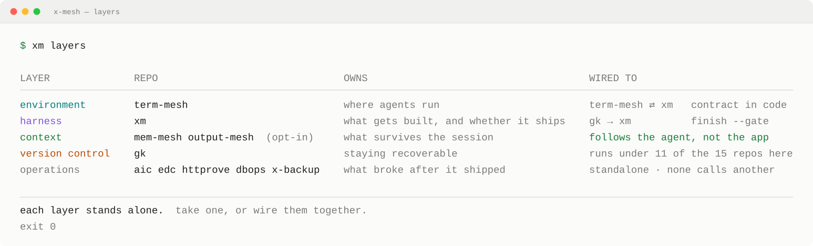

<h1 align="center">x-mesh</h1>

  <strong>Find out what's actually wrong, without making it worse.</strong>

  Tools built from one habit carried over from running production systems:
  limit the blast radius first, then judge on evidence instead of assumption.

  Most agent tooling ships the environment, the harness, and the memory as one
  product. These are the same layers, kept separate &mdash; each usable on its own,
  wired to the others by contract rather than by bundling.

---

## The layers

  <picture>
    <source media="(prefers-color-scheme: dark)" srcset="./assets/layers.dark.svg">
    
  </picture>

Rendered by <a href="https://github.com/x-mesh/card">card</a> from <a href="./card.json">card.json</a>. The repository count in it is measured, not written down.

| Layer | | What it owns |
|---|---|---|
| **Environment** | [term-mesh](https://github.com/x-mesh/term-mesh) | Where agents run. A team of them in parallel, each in its own sandboxed worktree, on this Mac or over SSH. |
| **Harness** | [xm](https://github.com/x-mesh/xm) | What gets built, and whether it ships. Plans grounded in repository evidence, the smallest sufficient change, a cross-vendor panel that gates the result. |
| **Context** | [mem-mesh](https://github.com/x-mesh/mem-mesh) · [output-mesh](https://github.com/x-mesh/output-mesh) | What survives the session. `mem-mesh` keeps the decisions that never reach git, resumable work state, and injection that is measured rather than assumed. `output-mesh` catalogs what the agents actually wrote — every artifact traced back to the session that produced it. Both read-only, both attach at the agent so any environment that runs one picks them up. Opt-in everywhere, required nowhere. |
| **Version control** | [gk](https://github.com/x-mesh/gk) | Staying recoverable. Reflog-backed undo, time-machine restore, policies as code. |
| **Operations** | [aic](https://github.com/x-mesh/aic) · [edc](https://github.com/x-mesh/edc) · [httprove](https://github.com/x-mesh/httprove) · [dbops](https://github.com/x-mesh/dbops) · [x-backup](https://github.com/x-mesh/x-backup) | What broke after it shipped. Diagnosis is read-only and stops at the fault; anything that writes needs an explicit flag and offers a dry run first. These do not call each other; each is picked up on its own. |

Each layer stands alone. `mem-mesh` is an MCP server any client can call. `edc` and
`httprove` are plain CLIs. `xm` is explicitly built to keep working with no term-mesh
in sight.

They connect two different ways. Some edges are contracts in code — `xm` and
`term-mesh` each hold the other's integration spec, `gk` hands a finished worktree to
`xm`'s gate. Others are opt-in: `mem-mesh` lives in the agent's own configuration, so
it follows the agent into whichever environment launched it. Nothing here requires it.
Run `term-mesh` without it and the agents still work — they just start every session
from nothing. Add it and context is covered at both ends: `term-mesh` watches how full
the live window is, `mem-mesh` keeps what matters when that window resets.

## Why it is built this way

From `term-mesh`, on why an unknown model returns no context limit instead of a default:

> A percentage computed against a guessed denominator looks exactly like a measured one.

That is the rule the rest of this follows. Diagnostics stop at the diagnosis. Changes
stay recoverable. Nothing reports a number it did not measure.

Also here

 

- **[space-mesh](https://github.com/x-mesh/space-mesh)** — macOS disk space analyzer. SwiftUI interface, Rust scanning core.
- **[headroom](https://github.com/x-mesh/headroom)** — Browser tool for topology authoring and infrastructure constraint analysis. Shows which capacity axis saturates first, in the browser, calculations kept local.
- **[clear-korean](https://github.com/x-mesh/clear-korean)** — Instruction set that makes AI answer in short, precise Korean.
- **[homebrew-tap](https://github.com/x-mesh/homebrew-tap)** — `brew tap x-mesh/tap`

---

  Read-only by default. Recoverable when it is not.

