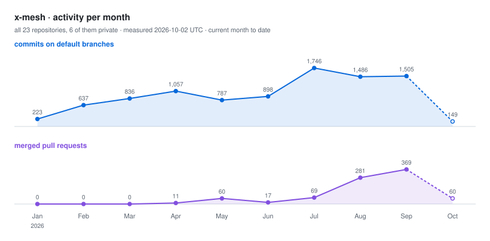
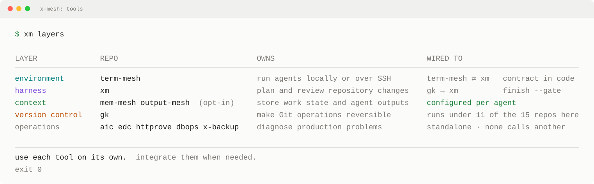

<h1 align="center">x-mesh</h1>

  <strong>Practical tools for building, running, and debugging AI agents.</strong>

  
  
  
  

  <picture>
    <source media="(prefers-color-scheme: dark)" srcset="./assets/activity.dark.svg">
    
  </picture>

  x-mesh is a collection of independent tools for agent development and production
  operations. Each tool works on its own, and integrations are explicit and optional.

  The projects follow the same operating rules: inspect before changing anything,
  keep changes reversible, and report measurements instead of guesses.

---

## The layers

  <picture>
    <source media="(prefers-color-scheme: dark)" srcset="./assets/layers.dark.svg">
    
  </picture>

Rendered by <a href="https://github.com/x-mesh/card">card</a> from <a href="./card.json">card.json</a>. The repository count is generated rather than hard-coded.

| Layer | | Purpose |
|---|---|---|
| **Environment** | [term-mesh](https://github.com/x-mesh/term-mesh) | Runs multiple agents in isolated worktrees, locally or over SSH. |
| **Harness** | [xm](https://github.com/x-mesh/xm) | Plans small repository changes from code evidence and reviews the result with multiple models before merge. |
| **Context** | [mem-mesh](https://github.com/x-mesh/mem-mesh) · [output-mesh](https://github.com/x-mesh/output-mesh) | `mem-mesh` stores decisions and resumable work state. `output-mesh` records agent artifacts and the sessions that produced them. Both are optional, read-only integrations configured per agent. |
| **Version control** | [gk](https://github.com/x-mesh/gk) | Adds reflog-based undo, snapshot restore, and repository policies. |
| **Operations** | [aic](https://github.com/x-mesh/aic) · [edc](https://github.com/x-mesh/edc) · [httprove](https://github.com/x-mesh/httprove) · [dbops](https://github.com/x-mesh/dbops) · [x-backup](https://github.com/x-mesh/x-backup) | Diagnoses shell, system, network, HTTP, database, and backup problems. Diagnostic actions are read-only by default. Commands that write require an explicit flag and offer a dry run. |

The tools do not depend on one another. `mem-mesh` is an MCP server, `edc` and
`httprove` are standalone CLIs, and `xm` works without `term-mesh`.

Integrations use explicit contracts. `xm` and `term-mesh` share integration specs, and
`gk finish --gate` sends a completed worktree to `xm` for review. `mem-mesh` is
configured per agent and works with any supported environment. Without it, `term-mesh`
still runs but starts each session without saved context.

## Design rules

`term-mesh` leaves the context limit unknown when it does not recognize a model:

> A percentage computed against a guessed denominator looks exactly like a measured one.

A guessed limit would make an estimate look measured. The same rule applies elsewhere:
diagnostics do not make changes by default, write operations are explicit, and reported
figures come from collected data.

Also here

 

- **[space-mesh](https://github.com/x-mesh/space-mesh)**: macOS disk space analyzer. SwiftUI interface, Rust scanning core.
- **[headroom](https://github.com/x-mesh/headroom)**: Browser tool for topology authoring and infrastructure constraint analysis. Shows which capacity axis saturates first, in the browser, calculations kept local.
- **[clear-korean](https://github.com/x-mesh/clear-korean)**: Instruction set that makes AI answer in short, precise Korean.
- **[homebrew-tap](https://github.com/x-mesh/homebrew-tap)**: `brew tap x-mesh/tap`

